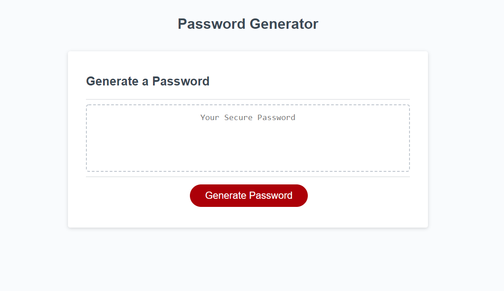

# **Password Generator**
## Webpage to generate a random password

### **Project Description:**
This website generates a random password using the character types chosen by the user.
Users can choose between lower case, upper case, numeric and special characters.

### **Technolgies & Acceptance Criteria:**
Rakibul's Professional Portfolio website uses these technologies to work properly:
- [HTML] - HyperText Markup Language.
- [CSS] - Cascading Style Sheets used as the style sheet language.
- [JS] - Javascript Language.

This website was coded using the the Acceptance Criteria mentioned below:
- When the user clicks to generate a random password, they are presented with a series of prompts for password criteria.
- Users inputs are validated to make sure they choose a password length of at least 8 characters and no more than 128 characters.
- User is prompted for which of the 4 character types to include as part of the randomly generated password.
- At least one character type should be selected or else the program will exit.
- When all prompts are answered, a randomly generated password is generated that matches the selected criteria.
- The randomly generated password is displayed to the webpage.

### **Deployed website link:**
https://rakibca.github.io/password-generator/

### **Credits:**
- [W3Schools](https://www.w3schools.com "W3Schools")
- [MDN Web Docs](https://developer.mozilla.org "MDN Web Docs")
- [Google](https://www.google.com "Google's Homepage")